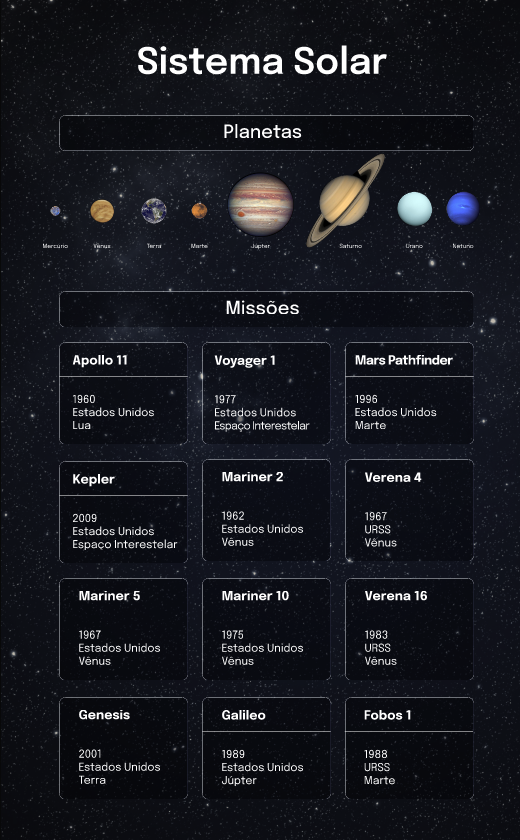
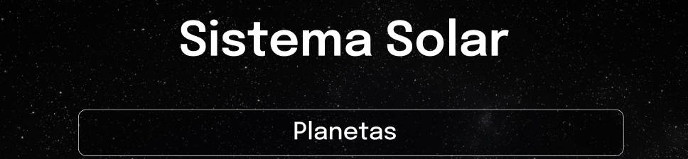
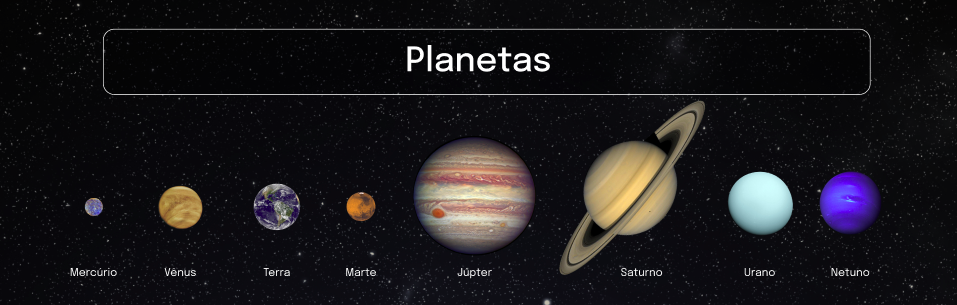

# Welcome to the Solar System project repository!

### README Translations:

-   [English](/README.en.md)
-   [Portuguese](/README.md)

* * *

## 👨‍💻 What was developed:

-   In this project I developed a model of the solar system. By using this application, a user is able to:

    -   View all the planets of the solar system rendered on the screen;

    -   View all cards with information about space missions;

:bulb:**See a sample below:**



## Skills Used:

-   Using JSX in React;
-   Use the method correctly`render()`to render its components;
-   Use`import`to bring components in different files;
-   Create class components in React;
-   Create multiple components from an array;
-   Make use of`props`correctly;
-   Make use of`PropTypes`to validate the`props de um componente`.

# requirements

## 1. Create a component called`Header`

<details>
  <summary>Crie um componente chamado <code>Header</code> dentro da pasta <code>src/components</code>. Este componente irá renderizar o título principal da página.</summary>

-   It must contain a tag`header`and, inside it, a tag`h1`. the tag text`h1`should be "Solar System";
-   render the component`Header`inside the main component`App`.

    

    </details>

<details>
  <summary><strong>O que será verificado</strong></summary><br />

-   It will be validated if the component`<Header />`is rendered;

-   It will be validated if the component`<Header />`contains a tag`header`;

-   It will be validated if the component`<Header />`contains a tag`h1`;

-   It will be validated if the component`<Header />`correctly renders the text "Solar System";

-   It will be validated if the component`<Header />`is being rendered not parent component`App`.
    </details>

* * *

## 2. Create a component called`SolarSystem`

<details>
  <summary>Crie um componente chamado <code>SolarSystem</code> dentro da pasta <code>src/components</code>.</summary>

-   the component`SolarSystem`must have a`div`that involves all its content and that has the attribute`data-testid="solar-system"`;

-   render the component`SolarSystem`below the`Header`, inside the main component`App`.
    </details>

<details>
  <summary><strong>O que será verificado</strong></summary><br />

-   It will be validated if the component`<SolarSystem />`is rendered;

-   It will be validated if there is a`div`who owns the`data-testid="solar-system"`;

-   It will be validated if the component`<SolarSystem />`is being rendered not parent component`App`.
    </details>

* * *

## 3. Create a component called`Title`

<details>
  <summary>Crie um componente chamado <code>Title</code> dentro da pasta <code>src/components</code>.</summary>

-   the component`Title`must receive a proposal`headline`;
-   It must contain a tag`h2`, which should render the text received by the prop`headline`.
    </details>

<details>
  <summary><strong>O que será verificado</strong></summary><br />

-   It will be validated if the component`<Title />`is rendered;

-   It will be validated if the component`<Title />`contains a tag`h2`;

-   It will be validated if the component`<Title />`renders the text passed by the prop`headline`inside a tag`h2`.
    </details>

* * *

## 4. Render the component`Title`inside the component`SolarSystem`

<details>
  <summary>Renderize o componente <code>Title</code> dentro do componente <code>SolarSystem</code>.</summary>

-   the component`Title`should be rendered receiving the prop`headline`with the value "Planets".

    

    </details>

<details>
  <summary><strong>O que será verificado</strong></summary><br />

-   It will be validated if the text "Planets" is rendered using the component`Title`inside the component`SolarSystem`.
    </details>

* * *

## 5. Create a component called`PlanetCard`

<details>
  <summary>Crie um componente chamado <code>PlanetCard</code> dentro da pasta <code>src/components</code>.</summary>

-   the component`PlanetCard`should receive two props: a call`planetName`and another call`planetImage`;

-   the component`PlanetCard`must have a`div`that involves all its content and that has the attribute`data-testid="planet-card"`;

-   the component`PlanetCard`should render the text received by the prop`planetName`. We suggest using tags from[Flow Content](https://developer.mozilla.org/pt-BR/docs/Web/Guide/HTML/Content_categories#conte%C3%BAdo_de_fluxo), as`<p>`, which must contain the attribute`data-testid="planet-name"`;

-   the component`PlanetCard`should render an image that has the attribute`src`with the amount received by the prop`planetImage`;

-   In addition to the attribute`src`, the rendered image must have the attribute`alt`with the text`Planeta {planetName}`, Where`{planetName}`is the value received by the prop`planetName`.
    </details>

<details>
  <summary><strong>O que será verificado</strong></summary><br />

-   It will be validated if the component`<PlanetCard />`is rendered;

-   It will be validated if the component`<PlanetCard />`has a div with the attribute`data-testid="planet-card"`;

-   It will be validated if the text received by the prop is rendered`planetName`;

-   It will be validated if an image is rendered with the attribute`src`with the same amount received by the prop`planetImage`;

-   It will be validated if, in addition to the attribute`src`, the rendered image has the attribute`alt`with the text`Planeta {planetName}`, Where`{planetName}`is the value received by the prop`planetName`.
    </details>

* * *

## 6. Render a list of the planets in the Solar System

<details>
  <summary>Renderize uma lista com os planetas do Sistema Solar dentro do componente <code>SolarSystem</code>.</summary>

-   Use the component`PlanetCard`to render each item in the list of planets;

-   You will find the list with the names and images of each planet in the Solar System in the archive`src/data/planets.js`;

-   You must import the list into the component`SolarSystem`using code:
    ```javascript
    import planets from '../data/planets';
    ```

-   The list of planets is a_array_of objects in the following format:
    ```javascript
    {
      name: "Nome do planeta",
      image: "caminho-para-imagem-do-planeta"
    }
    ```

-   For each planet in the list, you must render a component`PlanetCard`, passing the attribute`name`for to prop`planetName`and the attribute`image`for to prop`planetImage`.

    

    </details>

<details>
  <summary>:bulb: Dica: </summary> 

-   Remember the method that allows you to create several equal components from the values ​​present in a_array_. Remember that when rendering a list, you must pass the attribute`key`for each item. You can use the planet's name as`key`.
    </details>

<details>
  <summary><strong>O que será verificado</strong></summary><br />

-   It will be checked if a component is rendered`<PlanetCard />`for each planet in the list of planets;

-   It will be checked if all the planets in the Solar System are being listed on the screen.
    </details>

* * *

## 7. Create a component called`Missions`.

<details>
  <summary>Crie um componente chamado <code>Missions</code> dentro da pasta <code>src/components</code>.</summary>

-   This component must have a`div`that involves all its content and that has the attribute`data-testid="missions"`;

-   render the component`Missions`below the`SolarSystem`, inside the main component`App`.
    </details>

<details>
<summary><strong>O que será verificado</strong></summary><br />

-   It will be validated if the component`<Missions />`is rendered;

-   It will be validated if there is a`div`who owns the`data-testid="missions"`;

-   It will be validated if the component`<Missions />`is being rendered not parent component`App`.
    </details>

* * *

## 8. Render the component`Title`inside the component`Missions`.

<details>
  <summary>Renderize o componente <code>Title</code> dentro do componente <code>Missions</code>.</summary>

-   the component`Title`should be rendered receiving the prop`headline`with the value "Missions".

    

    </details>
    <details>
    <summary><strong>O que será verificado</strong></summary><br />


-   It will be validated if the text "Missions" is rendered using the component`Title`inside the component`Missions`.
    </details>

* * *

## 9. Create a component called`MissionCard`.

<details>
  <summary>Crie um componente chamado <code>MissionCard</code> dentro da pasta <code>src/components</code>.</summary>

-   the component`MissionCard`should receive four props:
    -   `name`
    -   `year`
    -   `country`
    -   `destination`

-   the component`MissionCard`must have a`div`that involves all its content and that has the attribute`data-testid="mission-card"`;

-   the component`MissionCard`should render the text received by the prop`name`. We suggest using tags from[Flow Content](https://developer.mozilla.org/pt-BR/docs/Web/Guide/HTML/Content_categories#conte%C3%BAdo_de_fluxo), as`<p>`, which must contain the attribute`data-testid="mission-name"`;

-   the component`MissionCard`should render the text received by the prop`year`. We suggest using tags from[Flow Content](https://developer.mozilla.org/pt-BR/docs/Web/Guide/HTML/Content_categories#conte%C3%BAdo_de_fluxo), as`<p>`, which must contain the attribute`data-testid="mission-year"`;

-   the component`MissionCard`should render the text received by the prop`country`. We suggest using tags from[Flow Content](https://developer.mozilla.org/pt-BR/docs/Web/Guide/HTML/Content_categories#conte%C3%BAdo_de_fluxo), as`<p>`, which must contain the attribute`data-testid="mission-country"`;

-   the component`MissionCard`should render the text received by the prop`destination`. We suggest using tags from[Flow Content](https://developer.mozilla.org/pt-BR/docs/Web/Guide/HTML/Content_categories#conte%C3%BAdo_de_fluxo), as`<p>`, which must contain the attribute`data-testid="mission-destination"`.
    </details>

<details>
  <summary><strong>O que será verificado</strong></summary><br />

-   It will be validated if the component`<MissionCard />`is rendered;

-   It will be validated if the component`<MissionCard />`has a div with the attribute`data-testid="mission-card"`;

-   It will be validated if the text received by the prop is rendered`name`;

-   It will be validated if the text received by the prop is rendered`year`;

-   It will be validated if the text received by the prop is rendered`country`;

-   It will be validated if the text received by the prop is rendered`destination`.
    </details>

* * *

## 10. Render a list of space missions

<details>
  <summary>Renderize uma lista com as missões espaciais dentro do componente <code>Missions</code>.</summary>

-   Use the component`MissionCard`to render each quest list item;

-   You will find the list with the information of each space mission in the file`src/data/missions.js`;

-   You must import the list into the component`Missions`using code:
    ```javascript
    import missions from '../data/missions';
    ```

-   The list of space missions is a_array_of objects in the following format:
    ```javascript
    {
      name: 'Nome da missão',
      year: 'Ano de lançamento da missão',
      country: 'País que lançou a missão',
      destination: 'Destino da missão',
    }
    ```

-   For each space mission in the list, you must render a component`MissionCard`, passing each attribute to its respective prop.

    

    </details>
    <details>
    <summary>:bulb: Dica:</summary>

-   Remember the method that allows you to create several equal components from the values ​​present in a_array_. Remember that when rendering a list, you must pass the attribute`key`for each item. You can use the mission name as`key`.
    </details>

<details>
  <summary><strong>O que será verificado</strong></summary><br />

-   It will be checked if a component is rendered`<MissionCard />`for each space mission in the mission list;

-   It will be checked if all space missions are being listed on the screen.
    </details>

* * *
